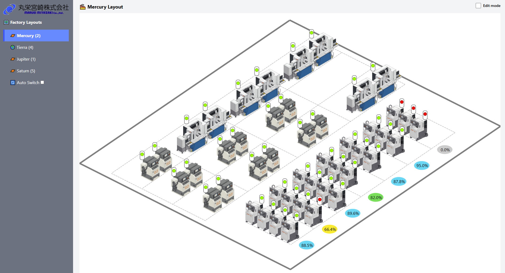

# 🧭 MACHINE LAYOUT - FRONTEND  
**Hệ thống hiển thị trực quan trạng thái và hiệu suất máy trong nhà máy**

**工場内の機械の状態と稼働率を可視化するシステムのフロントエンド**



---

## 📁 1. Cấu trúc thư mục | ディレクトリ構成

```
src/
├── index.html                  # ⚙️ Tệp HTML gốc (Angular mount vào đây)  
                                # ⚙️ AngularがマウントされるHTMLのエントリーポイント  
├── main.ts                     # 🚀 Khởi động ứng dụng Angular  
                                # 🚀 Angularアプリの起動処理  
├── styles.scss                 # 🎨 Style toàn cục (Tailwind CSS)  
                                # 🎨 全体スタイル（Tailwind CSS）  
├── app/
│   ├── app.component.*         # 🧩 Component gốc  
│                               # 🧩 アプリのルートコンポーネント  
│   ├── app.routes.ts           # 🔀 Định tuyến cho từng nhà máy  
│                               # 🔀 各工場ごとのルーティング設定  
│   ├── app.config.ts           # ⚙️ Cấu hình chung Angular  
│                               # ⚙️ Angular全体の構成設定  
│   ├── models/                 # 📦 Interface dữ liệu (máy móc)  
│                               # 📦 機械データのインターフェース定義  
│   ├── services/               # 🔌 Gọi API lấy dữ liệu từ backend  
│                               # 🔌 バックエンドからデータを取得するサービス  
│   ├── layouts/dashboard/      # 📋 Giao diện chính có sidebar menu  
│                               # 📋 サイドバー付きのメインレイアウト画面  
│   ├── mercury/                # 🏭 Component nhà máy Mercury  
│                               # 🏭 Mercury工場のコンポーネント  
│   ├── tierra/                 # 🏭 Component nhà máy Tierra  
│                               # 🏭 Tierra工場のコンポーネント  
│   ├── jupiter/                # 🏭 Component nhà máy Jupiter  
│                               # 🏭 Jupiter工場のコンポーネント  
│   └── saturn/                 # 🏭 Component nhà máy Saturn  
│                               # 🏭 Saturn工場のコンポーネント  
```

---

## ▶️ 2. Cách chạy thử frontend | フロントエンドの起動方法

### Bước 1: Cài đặt Node.js + Angular CLI / ステップ1：Node.js + Angular CLIのインストール  
**Node.js**: https://nodejs.org/en  
**Angular CLI**:  
```bash
npm install -g @angular/cli
```

---

### Bước 2: Cài đặt dependencies và khởi động server / ステップ2：依存関係のインストールと起動  
```bash
cd machine-layout-frontend
npm install
```

---

### Bước 3. Cài đặt Tailwind CSS / ステップ3：Tailwind CSS の導入

```bash
npm install -D tailwindcss postcss autoprefixer
npx tailwindcss init
```

**Update `tailwind.config.js`:**

```js
module.exports = {
  content: ["./src/**/*.{html,ts}"],
  theme: { extend: {} },
  plugins: [],
}
```

**Update `src/styles.scss`:**

```scss
@tailwind base;
@tailwind components;
@tailwind utilities;
```

---

### 🧪 Chạy thử ứng dụng / ローカルサーバー起動

```bash
ng serve
```

Truy cập / アクセス: `http://localhost:4200`

---
## 🌐 3. Chức năng chính | 主な機能

| Tính năng (VI)                                | 機能 (JA)                                   |
|-----------------------------------------------|---------------------------------------------|
| Hiển thị trạng thái máy theo màu sắc          | 色で機械の状態を表示                        |
| Hiển thị hiệu suất theo hình elip + %         | 楕円＋％で機械の稼働率を視覚化              |
| Cập nhật tự động mỗi 5 giây                   | 5秒ごとにデータを自動更新                  |
| Sidebar menu để chọn nhà máy                 | サイドバーで工場を切り替え可能             |
| Tự động chuyển nhà máy mỗi 30 giây (tuỳ chọn) | 工場を30秒ごとに自動巡回（オプション）     |

---

## 📡 4. API Backend yêu cầu | 必要なバックエンドAPI

Frontend sẽ gọi API dạng sau:
必要なAPI形式：

```http
GET http://<BACKEND_HOST>:3000/machine?factory=2
```

Trong đó:
- `factory=2` là mã nhà máy (2 = Mercury, 4 = Tierra, v.v.)
- `factory=2`：工場コード（例：2=Mercury）

---

## 👥 5. Đối tượng chuyển giao | 引き渡し対象者

- Kỹ sư nhà máy Nhật Bản (chưa biết Angular/TypeScript)
- Angular や TypeScript に不慣れな日本の工場エンジニア  

- Mục tiêu: Xem layout, tái triển khai đơn giản
- 目的：レイアウトの確認、簡単な再展開ができること  

---

## 📌 6. Ghi chú bổ sung | 補足事項

- Tất cả comment trong mã nguồn đều có song ngữ 🇻🇳🇯🇵
- ソースコード内のすべてのコメントはベトナム語・日本語のバイリンガル対応 🇻🇳🇯🇵  

- Code tuân thủ Angular standalone component (không cần AppModule)
- コードは Angular のスタンドアロンコンポーネント構成に準拠（AppModule 不要） 

- Layout SVG có thể chỉnh sửa hoặc thay thế thủ công
- SVG レイアウトは手動で編集または差し替えが可能  

---

# Frontend

This project was generated using [Angular CLI](https://github.com/angular/angular-cli) version 19.2.11.

## Development server

To start a local development server, run:

```bash
ng serve
```

Once the server is running, open your browser and navigate to `http://localhost:4200/`. The application will automatically reload whenever you modify any of the source files.

## Code scaffolding

Angular CLI includes powerful code scaffolding tools. To generate a new component, run:

```bash
ng generate component component-name
```

For a complete list of available schematics (such as `components`, `directives`, or `pipes`), run:

```bash
ng generate --help
```

## Building

To build the project run:

```bash
ng build
```

This will compile your project and store the build artifacts in the `dist/` directory. By default, the production build optimizes your application for performance and speed.

## Running unit tests

To execute unit tests with the [Karma](https://karma-runner.github.io) test runner, use the following command:

```bash
ng test
```

## Running end-to-end tests

For end-to-end (e2e) testing, run:

```bash
ng e2e
```

Angular CLI does not come with an end-to-end testing framework by default. You can choose one that suits your needs.

## Additional Resources

For more information on using the Angular CLI, including detailed command references, visit the [Angular CLI Overview and Command Reference](https://angular.dev/tools/cli) page.
